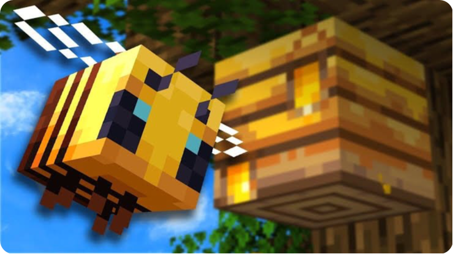

<file-attachment-contents filename="README.md">

<h1 align="center">
  <br>
  <a href="https://github.com/SilkePilon/lodestone/"></a>
  <br>
</h1>

<h4 align="center">🤖 An free and fully open source alternative for QQMiner.</h4>

<p align="center">
    
      <a href="https://python.org/"></a>
  <a href="https://github.com/reworkd/AgentGPT/blob/master/docs/README.zh-HANS.md"></a>
  <a href="soon!"></a>
</p>

<p align="center">
  <a href="#about">About</a> •
  <a href="#key-features">Key Features</a> •
  <a href="#how-to-use">How To Use</a> •
  <a href="#how-to-install">Install</a> •
  <a href="#credits">Credits</a> •
  <a href="#license">License</a>
</p>

<!--  -->

## About 📬

Project Beehive is an open source Minecraft bot with a goal to provide players access to helpful gameplay features at no cost. Developed with a clean user interface, Project Beehive offers various plugins and options similar to paid alternatives out there. The project is completely free, open source, and welcoming to contributions from the Minecraft community. Check the wiki for information on plugins, setup guides, contributing, and more. We aim to provide Minecraft players with an easy-to-use bot to enhance their gameplay experience without needing to pay. Feel free to open issues for bugs, suggestions, or questions!


## instalation 

```
docker run -p 8000:000 thelodestoneproject/beehive
```

</file-attachment-contents>
